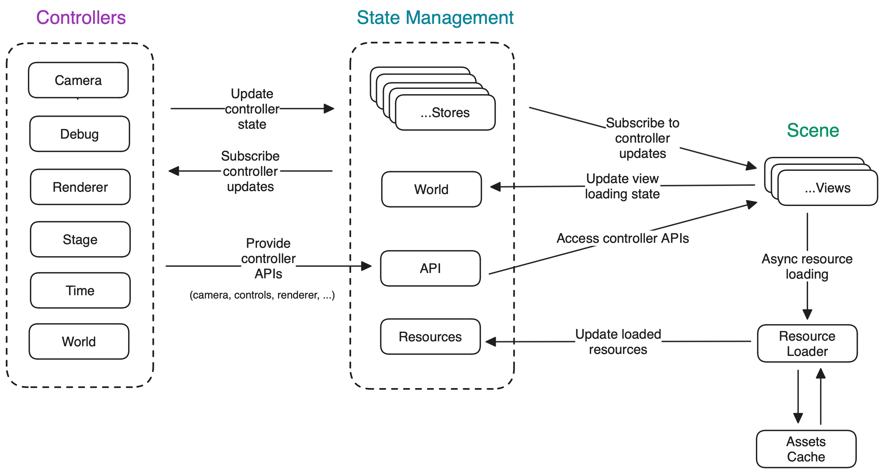
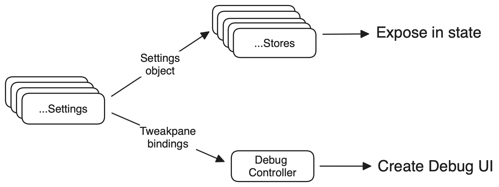

## Description

I started developing this vanilla Three.js template after watching the Code Structuring for Bigger Projects lesson from [Three.js Journey](https://threejs-journey.com/). I liked the idea so much that it quickly became a fun project for me to prototype WebGL experiences when following courses or replicating tutorials.

Recently, I went back to the course to take the new shader lessons and I wanted to refresh this template. It's hardly complete, but I keep tweaking things as I find new use cases, so it continues to evolve.

The example experience is the final project from Three.js Journey, my very first complex scene from when I started learning Three.js and WebGL. In the future, I'd love to add a more interesting example that better leverages the power of shaders. The debug UI only shows up in the `/debug` route.

### Features

- Architecture to synchronize views and controllers via events.
- Centralized state management implementation using Zustand.
- Custom Tweakpane plugin compatible with an external store.
- Typescript for type safety.
- Sensible ESLint and Prettier configurations.

## Architecture

<details>
<summary>Diagram</summary>

</details>

I did not want the project codebase to become too unwieldy by allowing the scene views and various controllers (renderer, camera, etc.) to import and call each other's methods indiscriminately.

To manage that type of communication, I divided the experience in three layers:

- **Controllers**: these initialize the experience and handle things such as camera, renderer, stage, and world behavior.
- **Views**: these are the scene objects created by the World controller and loaded as asynchronous entities. This approach decouples the resource loading stage. Each view notifies the central state when the loading is done so state subscribers can react accordingly.
- **State**: Communication between Controllers and Views is handled via a centralize Store layer.

State management is handled with [zustand](https://github.com/pmndrs/zustand), including subscriptions with selectors. Each controller implements its own state management and all stores are exposed from a central `Store` class.

## Debug Panels

<details>
<summary>Diagram</summary>

</details>

> [!NOTE]
> The debug UI only shows up in the `/debug` route.

I wanted to have a unified solution that handled both internal state and various configurable settings/tweaks. Because this is a typescript codebase, I added a custom implementation for [tweakpane](https://github.com/cocopon/tweakpane) that is type-safe and integrates with the state management store by overriding its internal [plugin system](src/debug). More about this in the debug [readme](src/debug/README.md) file.

Different debug tweaks can be added in the [settings](src/settings) folder. To keep things manageable, there is a settings file for each controller. The corresponding controller store will import the exported settings and expose them via the central state. Subscription to UI changes is handled as any other zustand subscription.

For convenience, debug configs are typed as object arrays. Some notes about this:

- It is possible to create [folders](https://tweakpane.github.io/docs/ui-components/#folder) and [bindings](https://tweakpane.github.io/docs/ui-components/#button) using the same APIs described in the official tweakpane docs
- I've added a QoL improvement to automatically listen to updates and refresh the binding accordingly, similarly to [lil-gui listen method](https://lil-gui.georgealways.com/#Controller#listen).
- Internally, the `reader` and `writer` functions are overridden to read from/write to the store instead of directly to the object.
- All `key` props are typed to the settings object defined in the file.
- An array of button configs can also be passed. Each button is defined as a function callback that receives the corresponding store instance. The function should return the [button params](https://tweakpane.github.io/docs/ui-components/#button) described in the official docs plus an `onClick` callback that will be passed to the `on('click')` event.

### BindingConfig signature

```ts
export type BindingConfig<T extends Bindable = Bindable> = {
  folder?: FolderParams;
  bindings?: Array<{
    key: keyof T;
    options?: BindingParams & {
      condition?: keyof T;
      listen?: boolean;
    };
  }>;
  buttons?: Array<{
    (store: StoreInstance<T>): ButtonParams & {
      onClick: (event: TpMouseEvent<ButtonApi>) => void;
    };
  }>;
};
```

### Example Settings for the Renderer

```ts
// ./src/settings/renderer.ts
export type RenderSettings = typeof renderSettings;
export type RenderConfig = BindingConfig<RenderSettings>;

const { r, g, b } = new Color(0x000011);

export const renderSettings = {
  anisotropy: 1,
  clearColor: { r, g, b, a: 1.0 },
};

export const renderConfig: RenderConfig[] = [
  {
    folder: {
      title: 'Renderer',
      expanded: false,
    },
    bindings: [
      {
        key: 'clearColor',
        options: {
          label: 'Clear Color',
          color: { type: 'float' },
        },
      },
    ],
    buttons: [
      (store) => ({
        title: 'button',
        onClick: (event) => {
          // do somethinh with `store` or `event`
        },
      }),
    ],
  },
];
```

## Develop

This project was created with [pnpm](https://pnpm.io), but any other package manager will work. Bundling is handled with [Vite](https://vitejs.dev).

### Commands

```shell
pnpm install # install package dependencies
pnpm dev     # start development server
pnpm lint    # [--fix] lint files
```

### Views

Most of the development should take place in the [`views/`](src/views) folder. Views are exported in order to the [`WorldController`](src/controllers/World.ts) by the [`index.ts`](src/views/index.ts) file, but each view is self-contained. They are loaded asynchronously and notify the [`WorldStore`](src/state/World.ts) when they complete loading their setup. There is an example [`Loading`](src/views/Loading.ts) view, set to bypass the loader flags, that gets destroyed once the rest of the views have finished.

Most of the time, when I start a project, I just delete the example [views](src/views) and clear the default [setttings](src/settings) and [assets](src/loaders/assets.ts). Then I can start creating the new views and adding whatever tweaks I need. Custom settings and tweaks will be fully typed and available in the appropriate store.

To create a view, just extend the [WebGLView](src/helpers/classes/WebGLView.ts) class. This class extends the Three.js `Group` interface, so anything added to it will be added to the scene. It also takes care of setting the loading flags and updating the state. Unfortunately, to make this bit of magic work, it is necessary to preserve the class `this` context, so make sure all your methods are arrow functions.

### Resources

To load textures and models, I've created a [ResourceLoader](src/loaders/ResourceLoader.ts) class that exposes various static methods. Some things to note:

- This class imports any resources declared in the [assets](src/loaders/assets.ts) file. The assets are fully typed and the static methods will use those types.
- By default, the `GLTFLoader` is initialized with the `DRACOLoader`. This setting can be changed in the [Experience (#L29)](src/Experience.ts) file.
- The DRACO decoder is included within the [public](public) folder, taken as is from `three/examples/js/libs/draco/`.

## Usage

As I mentioned in the description, this project is mostly for development fun. In production, I'd rather use [React Three Fiber](https://github.com/pmndrs/react-three-fiber) and [pmndrs/drei](https://github.com/pmndrs/drei). However, it should be easy to integrate it within other codebases. The experience is instantiated like any other class.

```ts
import { Experience } from './src/Experience';

import './src/styles/reset.css';
import './src/styles/webgl.css';
import './src/styles/tweak-pane.css';

const root = document.querySelector<HTMLDivElement>('#root');

if (!root) {
  throw new Error('Root element not found');
}

const { api, destroy } = new Experience(root);

// Callback when loaded
api.world.onLoad(() => console.log('Experience loaded'));

// Await loading
// await api.world.onLoadAsync();
// console.log('Experience loaded');
```

### API

The experience object exposes two properties:

- `api`: Static class exposing the internal stores for each controller. These provide methods to get, update, and subscribe to changes in the current state.
- `destroy`: Remove the experience views, including all geometries, materials, and object instances. It also unsubscribes all Zustand listeners.

### Styles

Some optional css styles are provided that work well with a stand-alone project.

- `reset.css`: Pretty much a copy-paste from the amazing Josh Comeau [custom CSS reset](https://www.joshwcomeau.com/css/custom-css-reset/). This one also removes default `padding` and button `border`.
- `webgl.css`: Applies only the WebGL `canvas` to remove it from the document flow and create its own stacking context. Regardless of this CSS, the experience will always respect the parent container dimensions whether it is the document or some other element.
- `tweakpane.css`: Adds some extra width to the main debug pane and sligthly adjusts the label:input width proportion of each binding blade, so that the input takes the majority of the available space.
